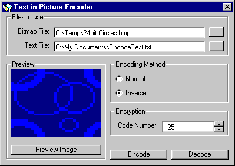



## Text in a Picture Encoder

### Description

Ok I've seen a few of these posted, and decided to post mine because out of the ones I've tested, mine has been the most space efficient and I think the fastest.

It will work with picture files of any size, as long as its big enough to hold the text, once encoded the picture is exactly the same size as before, and even on plain white pictures the difference is barely noticable. I also included the ability to encrypt the text before encoding, althought the algorithm is very basic it would help hide the track of text being there.

The program works by using the last 2 bits of each byte in the picture, which is enough to ensure good ratio of text file size to picture size, but little enough to not make much difference to the image.

In the comments I talk about the 1st and 2nd bits, these are numbered from the right, so the 1st bit is the right-most bit etc.

This is all my own work, so please vote!
 
### More Info
 

             |
---                |---
**Submitted On**   |2001-08-21 20:49:16
**By**             |[Steven Franks](https://github.com/Planet-Source-Code/PSCIndex/blob/master/ByAuthor/steven-franks.md)
**Level**          |Intermediate
**User Rating**    |4.6 (41 globes from 9 users)
**Compatibility**  |VB 6\.0
**Category**       |[Encryption](https://github.com/Planet-Source-Code/PSCIndex/blob/master/ByCategory/encryption__1-48.md)
**World**          |[Visual Basic](https://github.com/Planet-Source-Code/PSCIndex/blob/master/ByWorld/visual-basic.md)
**Archive File**   |[Text in a 250768212001\.zip](https://github.com/Planet-Source-Code/steven-franks-text-in-a-picture-encoder__1-26461/archive/master.zip)

